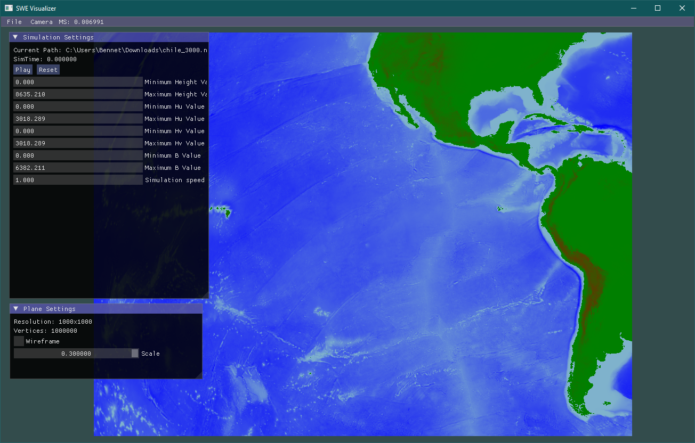

A OpenGL visualizer for shallow water equations.

# Features
- [x] Easy loading of NetCDF simulation files
- [x] Fast configuration of display settings
- [x] Move around the simulation plane in a intuitive way using your mouse or keyboard
- [x] Adjust playback settings (simulation speed, reverse, pause, etc.)

# Dependencies

- OpenGL
- [GLFW](https://github.com/glfw/glfw)
- [GLAD2](https://github.com/Dav1dde/glad)
- [GLM](https://github.com/g-truc/glm)
- [Dear ImGui](https://github.com/ocornut/imgui)
- [Catch2](https://github.com/catchorg/Catch2)
- NetCDF
- [ImGuiFileDialog](https://github.com/aiekick/ImGuiFileDialog)
- Doxygen

All dependencies other than OpenGL, Doxygen and NetCDF should be resolved by CMake itself.

# Quick Setup

Clone the project with `git clone --recurse-submodules git@gitlab.lrz.de:bennet/swevisualizer.git`.
Make sure you have NetCDF & Doxygen installed and added to PATH if using Windows.

## Build System

Currently only tested under Windows. For  Windows it is needed that NetCDF is installed and the bin directory added to PATH.

For compilation, CMake, Make and a suitable compiler (e.g. gcc, clang, msvc) is needed.

1. Create a build directory: `mkdir build`, with `build` being a directory name of your choice.
2. Switch to the build directory: `cd build`
3. Run CMake: `cmake ..`. This might take a while as all dependencies are resolved, downloaded and 
compiled.

## Compiling

Linux: Compile inside the `build` directory using `make`. A executable should appear inside your
`build` directory.

Windows: Compile using `cmake --build .` inside the `build` directory. The executable might be hidden under `build\src\Debug\SWEVisualizer.exe`.

## Documentation
To build the doxygen documentation, build the `doxygen` target.
On Windows, the output directory might be hidden under `build/src/html`.
## Running the Visualizer

1. Make sure you're inside the `build` directory.
2. Run the visualizer using `./SWEVisualizer`, under Windows your command might need to look like this: `./build/src/Debug/SWEVisualizer.exe`.

If you want to move the SWEVisualizer executable somewhere else, always make sure the
`resources` directory is in the same directory as your executable.

# Hints

## The visualizer crashes with `Shader File cannot be found`?

Make sure you're running the Visualizer from a directory that also has a `resources` directory. `resources` contains all shaders, images and other assets necessary for the
visualizer to run.

# Other hints

In the top bar you will find a Debug menu, that can display different debug tools. Currently available:
- ImGui Debug Window
